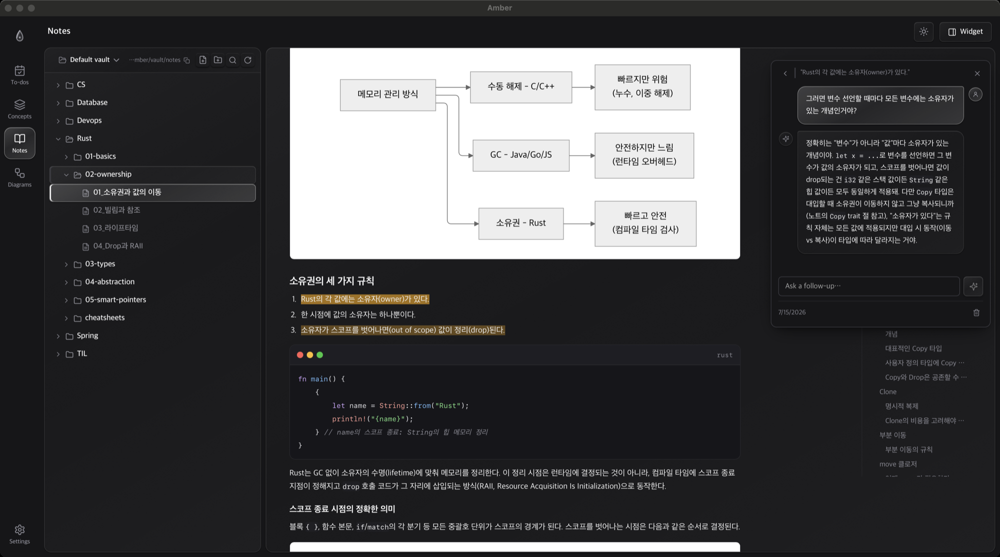
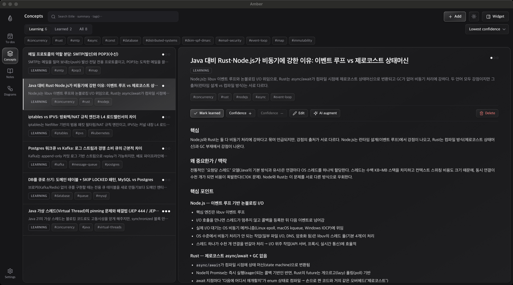
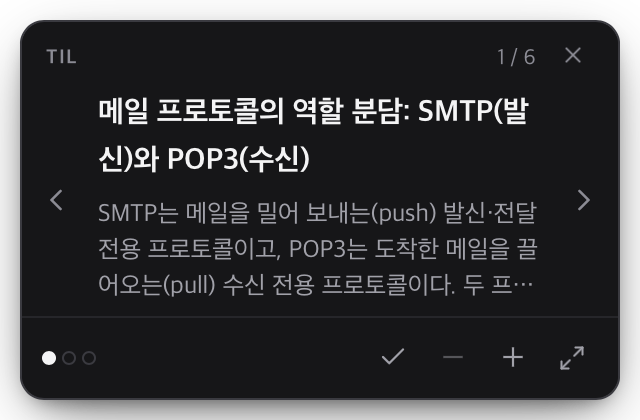
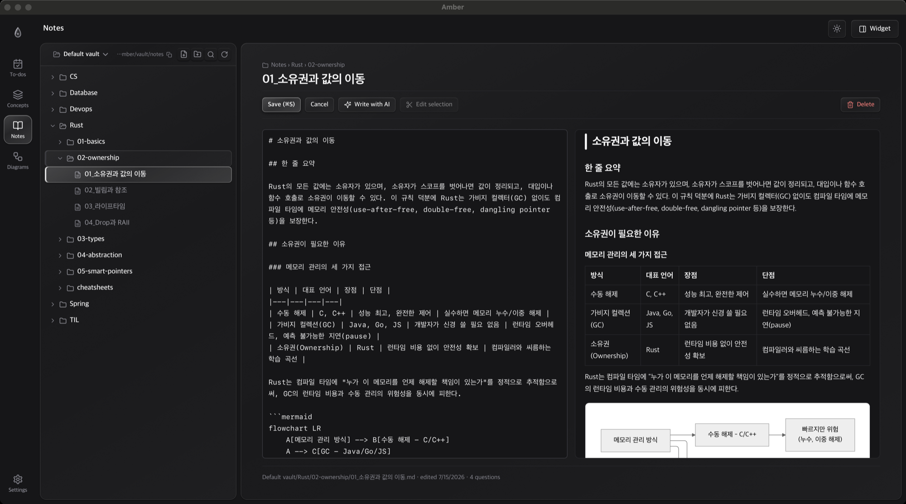
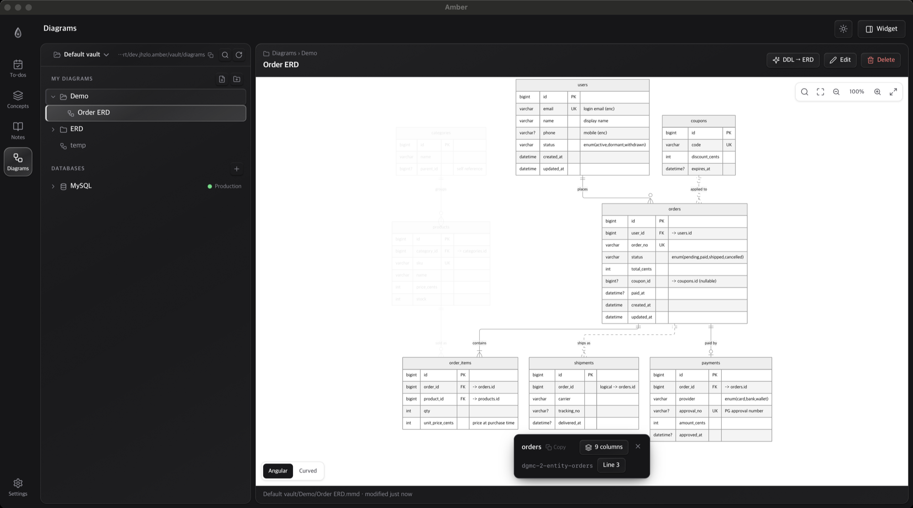
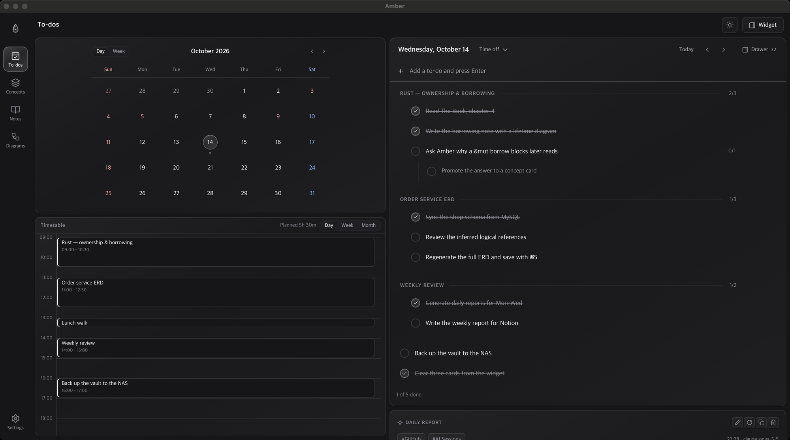

<h1 align="center">
   Amber
</h1>

<p align="center">
  
  
  
  
  
</p>

<p align="center">
  <strong>Keep what you learn from fading — preserved like amber.</strong><br/>
  Concept flashcards, markdown notes, mermaid diagrams and a daily planner in one
  local-first macOS app,<br/> powered by the AI CLIs you already pay for.
</p>

<p align="center">
  <sub>Everything lives on your machine as plain text. No server, no accounts, no API keys stored. UI is currently Korean-first.</sub>
</p>

<p align="center">
  
</p>

## Features

<table>
<tr>
<td width="50%" valign="middle">

### 🧠 Concept flashcards

Paste a raw AI Q&A transcript and your connected AI turns it into a reviewable card — title, summary, detailed note, tags — that you edit before saving. Confidence dots (`● ○ ○`) and a graduation ("learned") model keep the deck focused on what you haven't internalized yet. Augment any card later with a one-line instruction like *"add example code"*.

</td>
<td width="50%">
  
</td>
</tr>
<tr>
<td width="50%" valign="middle">

### 📌 Desktop sticker widget

An always-on-top mini window cycles through the cards you're still learning, lowest-confidence first — so new knowledge keeps reappearing until it sticks. Flip through cards, bump confidence, or mark one learned right from the widget.

</td>
<td width="50%">
  
</td>
</tr>
<tr>
<td width="50%" valign="middle">

### 📝 Markdown notes

Real folders and files are the source of truth — no DB lock-in, friendly to git and external editors. Edit with a live side-by-side preview (`⌘S`), read with a floating scroll-spy table of contents, and render mermaid code fences inline. Select any sentence to ask the AI about it — answers are stored in a sidecar file and shown as Notion-style highlights, never bloating the note. AI drafting streams in live, and edits arrive as a git-style diff you review before applying.

</td>
<td width="50%">
  
</td>
</tr>
<tr>
<td width="50%" valign="middle">

### 📊 Mermaid diagram studio

Keep ERDs, flowcharts and sequence diagrams as plain `.mmd` files organized in folders. Pan/zoom canvas (wheel zoom · drag pan · double-click zoom · fit-to-screen shortcuts), live render while editing, and automatic recovery from common mermaid syntax mistakes. Paste raw `CREATE TABLE` DDL and the AI turns it into a house-style ERD — solid lines for real FK constraints, dotted for logical ones, nullability, indexes and enum values carried in the column notes.

</td>
<td width="50%">
  
</td>
</tr>
<tr>
<td width="50%" valign="middle">

### ✅ Todos & day timetable

A per-day checklist with unlimited nesting and drag reordering, a mini month calendar, and a Google-Calendar-style timetable: drag to create time blocks (15-minute snap), drag or resize to adjust, day/week/month views, and a live "now" line. Put any todo into the next free slot with one click, then let the AI write your daily report from todos and activity.

</td>
<td width="50%">
  
</td>
</tr>
</table>

## Also in the box

- **Works fully without AI** — notes, diagrams and todos never require a connection
- **Light / dark theme** — follows the system, one-click toggle, synced across windows
- **Safe deletes** — files go to the macOS Trash, not into the void
- **Saved prompts** — store your frequent AI instructions and reuse them as chips
- **One-click backup** — the 백업 action in 설정 exports a consistent snapshot of your vault
  and database. Don't copy `amber.db` by hand: it runs in WAL mode, so a raw copy of a running
  database can miss recent writes

## Supported AI CLIs

Amber connects to the AI CLIs you already use — it auto-detects them from your login
shell `PATH` on first launch, and reuses each CLI's login session. **No API keys are
ever stored in the app.**

| CLI | Notes |
|---|---|
| [Claude Code](https://claude.com/claude-code) | Full support incl. streaming responses |
| [OpenAI Codex CLI](https://developers.openai.com/codex) | Supported |
| [Gemini CLI](https://github.com/google-gemini/gemini-cli) | Supported |

## How your data is stored

Local-first, files-first. Long-form content is plain Markdown/text owned by the
filesystem; only volatile metadata (card status, todos, settings) lives in SQLite.

```
~/Library/Application Support/dev.jhzlo.amber/
├── amber.db                      # metadata — cards, todos, time blocks, settings
└── vault/
    ├── concepts/<ulid>/index.md  # concept detail notes
    ├── notes/**/*.md             # notes (+ *.comments.json Q&A sidecars)
    └── diagrams/**/*.mmd         # mermaid sources
```

## Install

Amber is distributed as source — clone and build it yourself.

**Requirements**

- macOS
- Node.js 20+ · [pnpm](https://pnpm.io)
- [Rust](https://rustup.rs) (stable)
- Optional, for AI features: one or more of the CLIs above, installed and logged in

**Run**

```bash
pnpm install
pnpm tauri dev      # development
pnpm tauri build    # production .app
```

> First launch shows an onboarding that auto-detects installed AI CLIs.
> The widget's transparent window uses `macOSPrivateApi`, so Amber is not
> App Store-eligible — which is fine, since you build it yourself.

## License

[MIT](./LICENSE)
