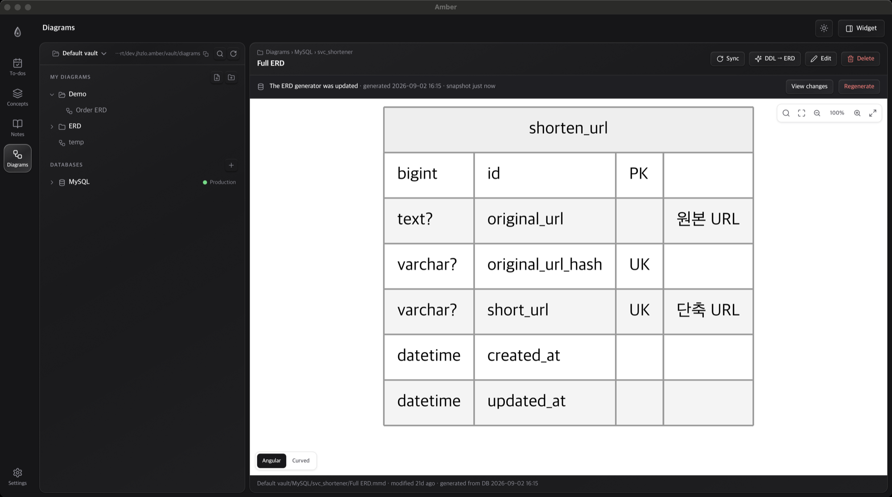

<h1 align="center">
   Amber
</h1>

<p align="center">
  
  
  
  
  
  
</p>

<p align="center">
  <strong>Keep what you learn from fading — preserved like amber.</strong><br/>
  Concept flashcards, markdown notes, mermaid diagrams, a day planner and AI-written daily
  reports<br/> in one local-first macOS app, powered by the AI CLIs you already pay for.
</p>

<p align="center">
  <sub>Everything lives on your machine as plain text. No server, no accounts, no API keys stored.
  Korean and English UI — AI output follows your UI language, or a language you pick.</sub>
</p>

<!--
  Hero. To swap this image for a video: drag an .mp4 (≤ 10 MB) into any GitHub comment box or
  the README web editor, copy the generated https://github.com/user-attachments/assets/… URL and
  put it here on its own line. GitHub renders it as an inline player (no autoplay). A GIF committed
  under docs/assets/ autoplays and loops instead, but is capped at 10 MB too.
-->
<p align="center">
  
</p>

## At a glance

| Workspace | What it does |
|---|---|
| 🧠 **Concepts** | Turn an AI chat transcript into a flashcard. Confidence dots and a “learned” model keep the deck focused on what you haven’t internalized. |
| 📌 **Desktop widget** | An always-on-top sticker cycles through the cards you’re still learning, weakest first. |
| 📝 **Notes** | Real markdown files in real folders. Live preview, scroll-spy TOC, inline AI Q&A, and AI edits scoped to a sentence, a section or the whole note — always as a reviewable diff. |
| 📊 **Diagrams** | Mermaid `.mmd` files on a pan/zoom canvas with table search, focus mode and two layout engines. Paste DDL and get a house-style ERD. |
| 🗄️ **Database sync** | Connect MySQL. Amber reads `information_schema`, writes one deterministic ERD per schema without AI, and shows a diff when the live schema drifts. |
| ✅ **To-dos & timetable** | Nested checklists per day or per week, a Google-Calendar-style time-blocking grid, Korean public holidays and time-off marks. |
| 📋 **Daily & weekly reports** | The AI writes your day as “problem → fix” from your to-dos, GitHub activity and local Claude Code / Codex sessions. Weekly rolls the dailies up into Notion-ready text. |

Works fully **without AI** — notes, diagrams, to-dos and database sync never need a connection.

## Features

<table>
<tr>
<td width="50%" valign="middle">

### 🧠 Concept flashcards

Paste a raw AI Q&A transcript and your connected AI turns it into a reviewable card — title,
summary, detailed note, tags — that you edit before saving. Or select a passage in any note and
**promote it to a concept** in place; the note remembers which concepts came from it.
Confidence dots (`● ○ ○`) and a graduation (“learned”) model keep the deck focused on what you
haven’t internalized yet. The canonical order is *lowest confidence, least recently seen first*,
so a card you just saw moves to the back of the line. Augment any card later with a one-line
instruction like *“add example code”* or *“pitfalls”*.

</td>
<td width="50%">
  
</td>
</tr>
<tr>
<td width="50%" valign="middle">

### 📌 Desktop sticker widget

An always-on-top mini window on every Space cycles through the cards you’re still learning,
lowest-confidence first — so new knowledge keeps reappearing until it sticks. Flip through cards,
bump confidence, or mark one learned right from the widget, entirely from the keyboard
(`←` `→` · `↑` `↓` · `Enter`). A menu-bar icon toggles the widget and brings the main window back.

</td>
<td width="50%">
  
</td>
</tr>
<tr>
<td width="50%" valign="middle">

### 📝 Markdown notes

Real folders and files are the source of truth — point the notes tree at **any folder on disk**
(a git repo, an Obsidian vault) and switch between recent ones like *Open Folder* in an IDE.
Edit with a live side-by-side preview whose two panes scroll together (`⌘S` to save), read with a
floating scroll-spy table of contents, find in the page with `⌘F`, and rename a note straight from
its title. Rendering understands GFM, GitHub-style `> [!NOTE]` alert blocks, syntax-highlighted
code blocks framed as macOS windows, `[[1-2]]` jumps to a numbered section, and mermaid fences
(even ones that forgot the `mermaid` tag).

**AI where you point.** Select any sentence to ask about it — answers live in a sidecar file and
show as Notion-style highlights, never bloating the note; every question on a note is also
collected into one list. Ask the AI to fix just the passage you dragged, one or several sections
you pick, or the whole note. Long results stream in live and every edit arrives as a git-style
diff you review before it touches the file. Saved prompts sit one click away as chips.

**Safe with other tools.** Saves are atomic, deletes go to the Trash, and if Obsidian, vim or git
changed the file while you had it open, Amber tells you before overwriting.

</td>
<td width="50%">
  
</td>
</tr>
<tr>
<td width="50%" valign="middle">

### 📊 Mermaid diagram studio

Keep ERDs, flowcharts and sequence diagrams as plain `.mmd` files organized in folders. Pan/zoom
canvas (wheel zoom · drag pan · double-click zoom · fit · full screen), live render while editing,
and automatic recovery from common mermaid mistakes. Search tables and columns right on the
canvas, click a table to **focus** it (unrelated tables dim) and read its column list in an info
card, and switch the layout engine between ELK (orthogonal, tidy self-references) and Dagre
(mermaid’s default curves) — the choice applies to diagrams inside notes too.

Paste raw `CREATE TABLE` DDL and the AI turns it into a **house-style ERD** — solid lines for
real FK constraints, dotted for logical ones, nullability, indexes and enum values carried in
the column notes.

</td>
<td width="50%">
  
</td>
</tr>
<tr>
<td width="50%" valign="middle">

### 🗄️ Database → ERD sync

Connect a MySQL database the DataGrip way — host · port · user, with the password stored **only
in the macOS Keychain** (never in Amber’s DB, files or logs). The connection becomes an ordinary
folder in the diagrams tree with one sub-folder per schema you pick. Amber reads
`information_schema` in a read-only session, keeps a `schema.json` snapshot per schema, and
generates the same house-style ERD **deterministically, without AI** — the same schema always
produces byte-identical output. Logical references (`order_id` → `orders`) are inferred from
names, comments and suffixes; Envers `*_aud` audit tables can be toggled off per schema.

Open a synced ERD later and a banner tells you when the live schema has drifted — tables and
columns added, removed or changed — with a full diff. Regeneration always lands as an editor
draft you save with `⌘S`; nothing is overwritten silently. Production connections carry a
“Production” badge everywhere and ask for confirmation on first connect. Connection status
shows as a live green dot in the tree and in *Settings › Databases*.

</td>
<td width="50%">
  
</td>
</tr>
<tr>
<td width="50%" valign="middle">

### ✅ To-dos & day timetable

A per-day checklist with unlimited nesting and drag reordering across levels, plus a per-week
list for things that have no day yet. Overdue items carry into today while the original day
keeps a faded record of what moved. The mini calendar drills up to month and year pickers, marks
weekends and **Korean public holidays** (computed offline — lunar table plus substitute-holiday
rules, no API key), and lets you mark a day as time off. Below it, a Google-Calendar-style
timetable: drag to create time blocks (15-minute snap), drag or resize to adjust, hold `⌥` to
plan on top of an existing block, day/week/month views and a live “now” line. Put any to-do into
the next free slot with one click.

</td>
<td width="50%">
  
</td>
</tr>
<tr>
<td colspan="2" valign="middle">

### 📋 Daily & weekly reports

One click at the bottom of a day’s checklist and the AI writes what you actually did — as
**problem → fix**, not a list of PR links. The to-dos are the backbone; evidence comes from the
sources you enable and rank in *Settings › Daily report*: your GitHub activity feed through the
`gh` CLI (pushes with commit messages, pull requests, reviews, issues, releases — with an account
picker and an optional repo filter) and your local **Claude Code** and **Codex** session logs, so
the work you delegated to an agent is in the report too. Slack and Notion can be added through
MCP servers already registered in Claude Code (read-only; write tools are denied). Generation
runs in the background, survives tab switches, can be stopped, and the result is a markdown file
you can edit by hand.

Switch the calendar to **week** and a weekly report rolls that week’s daily reports up into the
nested plain-text format that pastes cleanly into Notion.

</td>
</tr>
</table>

## Also in the box

- **Quick search** — `⌘K` (or `⌘P`) searches note and diagram names and bodies plus concepts in one box; `⌘F` finds within the current screen, including tables and columns on a diagram canvas
- **Sign in without leaving the app** — when a CLI token expires, Amber opens the login flow for Claude Code and Codex in a modal (the code goes straight to the CLI’s stdin; Amber stores nothing)
- **Pick the model** per provider, and **stop** any AI run mid-way
- **Korean & English UI** — from your system language, switchable in *Settings › Appearance*; the AI response language can follow the UI or be fixed separately
- **Light / dark theme** — follows the system, one-click toggle, synced across windows
- **Resizable panes** — drag the divider in every two-pane view; each view remembers its own width
- **Safe deletes** — files go to the macOS Trash, not into the void
- **One-click backup** — *Back up* in *Settings* exports a consistent snapshot of your vault, any custom folders and the database. Don’t copy `amber.db` by hand: it runs in WAL mode, so a raw copy of a running database can miss recent writes
- **Open the data folder** from *Settings* whenever you want to see the files yourself

## Keyboard shortcuts

| Main window | |
|---|---|
| `⌘1` – `⌘4` | Switch workspace (To-dos · Concepts · Notes · Diagrams) |
| `⌘K` / `⌘P` | Quick search across the vault |
| `⌘F` | Find in the current screen / diagram canvas |
| `⌘S` | Save the note, diagram or report you’re editing |
| `⌘,` | Settings |
| `Esc` | Close modal · leave full screen · deselect |

| Widget | |
|---|---|
| `←` `→` | Previous / next card |
| `↑` `↓` (or `]` `[`) | Raise / lower confidence |
| `Enter` or `D` | Mark learned |
| `O` or `Space` | Open the card in the main window |

## Supported AI CLIs

Amber connects to the AI CLIs you already use — it auto-detects them from your login shell
`PATH` on first launch and reuses each CLI’s login session. **No API keys are ever stored in the
app.**

| CLI | Streaming | In-app sign-in | Notes |
|---|---|---|---|
| [Claude Code](https://claude.com/claude-code) | ✓ | ✓ | Required for Slack / Notion report sources (uses its MCP servers) |
| [OpenAI Codex CLI](https://developers.openai.com/codex) | ✓ | ✓ (browser callback) | |
| [Gemini CLI](https://github.com/google-gemini/gemini-cli) | ✓ | terminal only | |

## How your data is stored

Local-first, files-first. Long-form content is plain Markdown/text owned by the filesystem;
only volatile metadata (card status, to-dos, time blocks, report metadata, connection profiles,
settings) lives in SQLite.

```
~/Library/Application Support/dev.jhzlo.amber/
├── amber.db                        # metadata — cards, to-dos, time blocks, reports, DB connections, settings
└── vault/
    ├── concepts/<ulid>/index.md    # concept detail notes
    ├── notes/**/*.md               # notes (+ *.comments.json Q&A · *.concepts.json promoted-concept links)
    ├── diagrams/**/*.mmd           # mermaid sources (+ <connection>/<schema>/schema.json DB snapshots)
    └── reports/<date>.md           # daily reports (+ <week-start>-week.md weekly)
```

Notes and diagrams don’t have to live here — the folder picker in each tree header opens any
local folder as that workspace’s root, and the backup includes those folders too. Database
passwords are in the macOS Keychain, not in any of these files.

## Install

Amber is distributed as source — clone and build it yourself. Tags are the releases; GitHub
serves a tarball for each one.

**Requirements**

- macOS with the Xcode Command Line Tools
- Rust toolchain from [rustup](https://rustup.rs) — it installs `rustc` and `cargo`, which `pnpm tauri` drives under the hood
- Node.js 20+ · [pnpm](https://pnpm.io)
- Optional, for AI features: one or more of the CLIs above, installed and logged in
- Optional, for reports: [`gh`](https://cli.github.com) logged in; for database sync: a MySQL account that can read `information_schema`

**Set up the toolchain** (once)

```bash
xcode-select --install                                          # Apple build tools (clang, git)
curl --proto '=https' --tlsv1.2 -sSf https://sh.rustup.rs | sh  # Rust: rustc + cargo, stable channel
corepack enable && corepack prepare pnpm@latest --activate      # pnpm (or: brew install pnpm)
```

Open a new terminal afterwards so `cargo` is on your `PATH`. The Tauri CLI is a dev dependency,
so `pnpm install` brings it in — nothing to install globally.

**Run**

```bash
pnpm install
pnpm tauri dev      # development — the first run compiles the Rust side and takes a few minutes
pnpm tauri build    # production .app
pnpm test           # vitest + cargo test
```

> First launch shows an onboarding that auto-detects installed AI CLIs.
> The widget’s transparent window uses `macOSPrivateApi`, so Amber is not
> App Store-eligible — which is fine, since you build it yourself.

## License

[MIT](./LICENSE)
